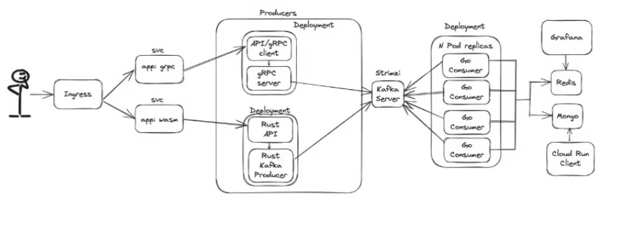
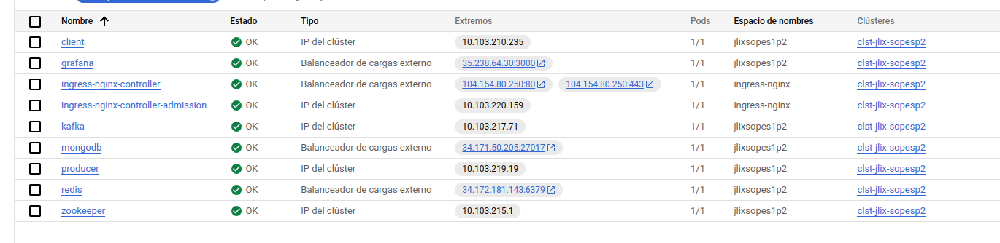
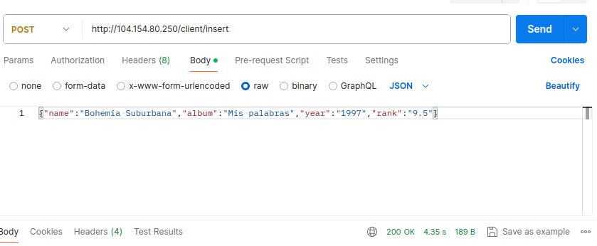
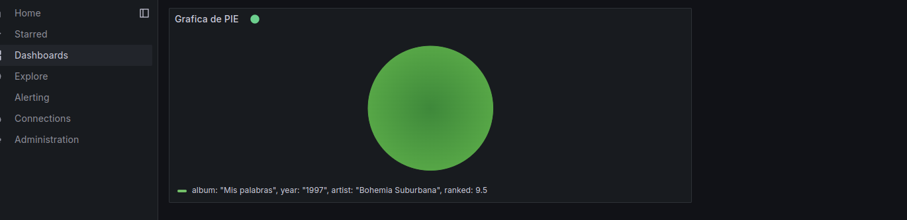
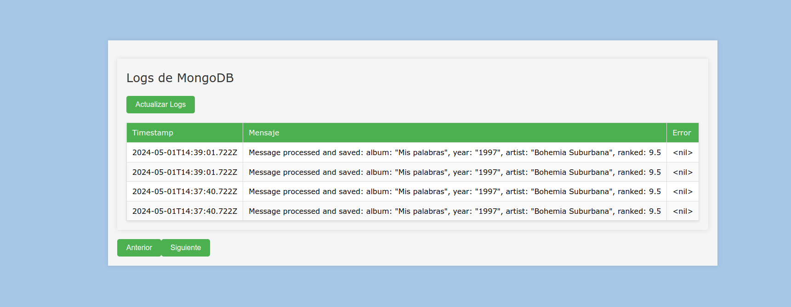

# DOCUMENTACION

## Introduccion
El siguiente proyecto fue desarrollado con el proposito de adquirir conocimientos en los sistemas cloud. Para este caso utilizamos google cloud haciendo uso de las siguiente tecnologías
* GRPC
* Docker
* Kubernetes
* Mongo
* Redis
* Grafana
* Kafka

En este el proyecto se implementó la siguiente arquitectura donde el proposito es un sistema de votaciones que se pueda dirigir a dos servidores, encolarlas con Kafka y que un consumer procesara la información y se insertaran los datos en mongo y redis. Para posterior ver la información en grafana y una aplicación web.

## Objetivos
1. Conocer las arquitecturas cloud
2. Implementar un sistema distribuido con microservicios en kubernetes
3. Encolar distintos servicios con sistemas de mensajerías utilizando kafka
4. Utilizar Grafana como interfaz gráfica de dashboards

## Descripción de tecnologías

### GRPC 
gRPC es un framework de comunicación de código abierto desarrollado por Google que permite la comunicación eficiente y rápida entre servicios distribuidos utilizando el protocolo HTTP/2 y RPC (Remote Procedure Call) para la comunicación entre clientes y servidores.

Para ello nosotros utilizamos golang haciendo uso de proto enviamos las peticiones binarias al cliente y despues al servidor que espera la petición para finalmente enviarla a kafka

### Docker

Docker es una plataforma de software que permite a los desarrolladores empaquetar, distribuir y ejecutar aplicaciones dentro de contenedores. Los contenedores son entornos ligeros y portables que incluyen todo lo necesario para que una aplicación se ejecute de manera independiente, incluyendo el código, las bibliotecas y las dependencias. Esto facilita la implementación y el escalado de aplicaciones en diferentes entornos de manera consistente.

Utilizado para crear las imagenes de todas nuestras soluciones, estas se pueden ver en docker hub con el usuario jlixdocker

### Kubernetes 

Kubernetes es un sistema de orquestación de contenedores de código abierto que automatiza la implementación, el escalado y la gestión de aplicaciones contenerizadas. Permite a los usuarios definir cómo deben ejecutarse sus aplicaciones, gestionar los recursos informáticos subyacentes y garantizar que las aplicaciones se ejecuten de manera confiable en entornos distribuidos y en la nube.

Se implementó para crear los microservicios y la comunicación entre los distintos pods involucrados.

### Mongo redis

Mongo como base de datos no relacional y redis como base de datos en memoria se utilizó para almacenar la información del sistema de votaciones y así posteriormente poder crear reportes.

### Kafka
es una plataforma de transmisión de datos de código abierto que se utiliza para la ingestión, almacenamiento y procesamiento en tiempo real de flujos de datos. 

Utilizado para encolar las peticiones realizadas por los servicios en grpc.

### Grafana

Grafana se utilizó para crear los diferentes dashboard y así tener una visualizacion de las votaciones realizadas.

## Descripción de los deployments y servicios

### Deployments de imagenes de docker oficiales

* Redis: El deployment creado utilizando una imagen oficial, tienen como caracteristicas las indicaciones de utilizar TCP y el puerto 6379
* Mongo: El deployment creado utilizando una imagen oficial, tienen como caracteristicas las indicaciones de utilizar TCP y el puerto 27017 y un volumen llamado mongodb-data
* Grafana: El deployment creado utilizando una imagen oficial, alojado en el puerto 3000 con el protocolo TCP
* Kafka: Haciendo uso de zookeeper connect para su debida conexión con los servicios, se aloja en el puerto 9092 con el protocolo TCP3
* Grafana: El deployment creado utilizando una imagen oficial, tienen como caracteristicas las indicaciones de utilizar TCP y el puerto 3000

### Deployments de imagenes de docker de jlixdocker

* Cliente: Realizado en go para enviar la información recibida por locust a al producer.
* Producer: Realizado en go para recibir las peticiones del cliente y posteriormente enviarlo a kafka
* Consumer: Realizado en go para recibir las peticiones encoladas y procesarlas para enviar los datos a las bases de datos.

### Servicios
* Ingress: Utilizado como balanceador para los diferentes consumers
* HorizontalPodAutoscaler: Autoscling para los diferentes deployments

### Funcionamiento 

Arquitectura

Ingress

Grafana

Visor mongo

## Conclusiones

Los microservicios son realmente provechosos al tener un altorendimiento y la tecnología cloud hace más eficiente y seguro el sistema ya al ser un proveedor de servicio nos podemos desligar de esas funciones. GRPC es altamente recomendado ya que es aún mas segura a utilizar http debido a las peticiones son enviadas en binario.

Se recomienda utilizar los microservicios en proyectos grandes ya que este puede crecer bastante a comparación al monolitico, así que requiere una mayor supervición del sistema.